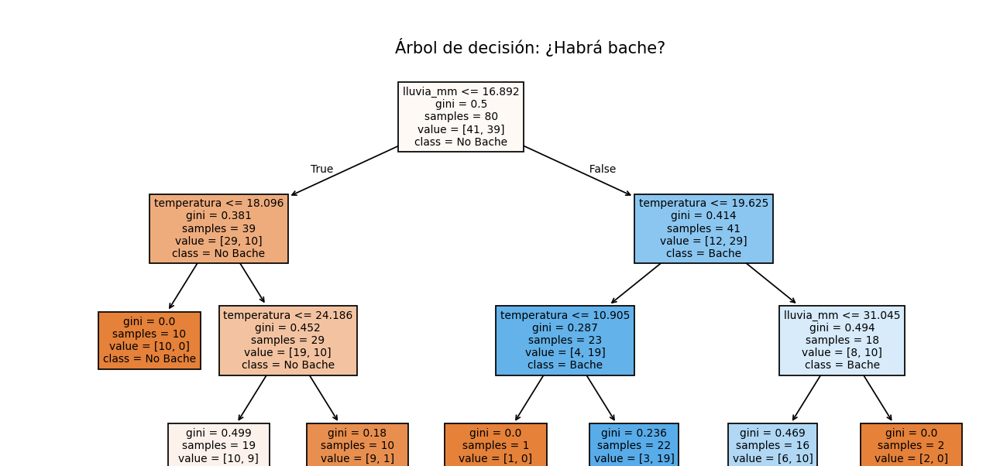

{width=50%}

# Reto Creativo – “Future of Fixing”    

    Generacion de Modelo De ML(Machine Learning) Para prediccion de reportes, basados en reporte de 100 dias

“Analizamos el historial de clima y encontramos patrones: por ejemplo, si llueve más de 20mm, los reportes de baches aumentan significativamente. Esto permite a la administracion predecir y anticipar problemas antes de que ocurran.

{width=80%}

## Video Expliacacion
https://youtu.be/ysfP0JVjHXw


### Author

    Paul Cadena
    Github: https://github.com/paulscc
    
