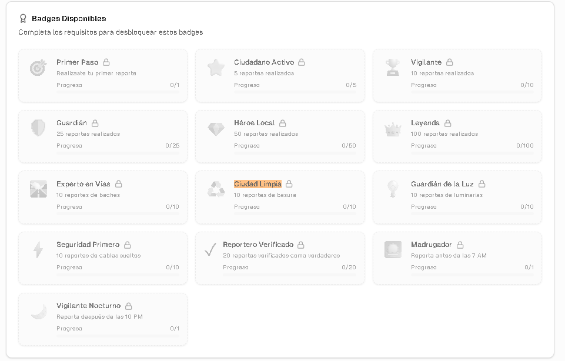

{width=50%}

# Reto 3 – Gamificación Aplicada (Sistema de Puntos y Badges)

{width=100%}

    Sistema de Logros, y puntos se obtendran puntos por hacer fierentes cosas como reportar diferentes categorias, 
    reportar bastantes, puntos por haber recibido una validacion por haberse resulto, etc y el sistema de logros como:

Primer Paso
    -Realizaste tu primer reporte
Ciudadano Activo
    -5 reportes realizados
Vigilante
    -10 reportes realizados
Guardián
25 reportes realizados
     Como en la imagen, etc

## Video Expliacacion
https://youtu.be/m0I9FzUzwV4


### Author

    Paul Cadena
    Github: https://github.com/paulscc
    
